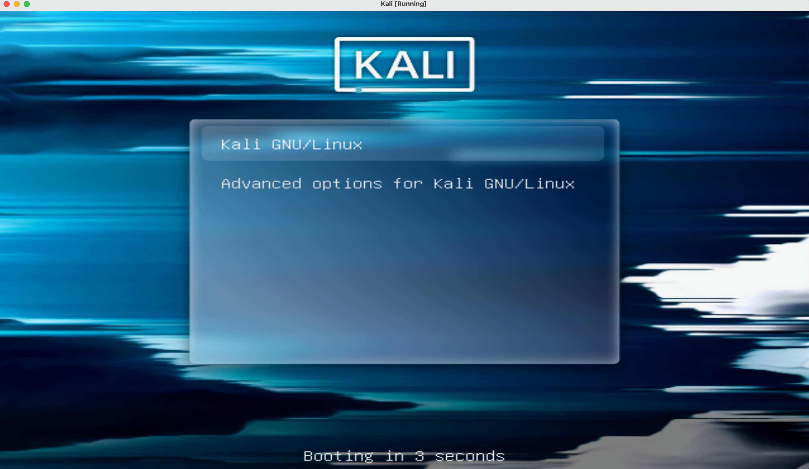

    

# Guide d'installation de Kali Linux sur VirtualBox
Bienvenue dans ce tutoriel d'installation de Kali Linux sur VirtualBox ! Ce guide est spécialement conçu pour les débutants en cybersécurité qui souhaitent se familiariser avec les environnements de machines virtuelles (VM). Que vous n'ayez jamais utilisé une VM ou que vous soyez novice dans le domaine de la cybersécurité, ce document vous accompagnera pas à pas pour installer et configurer Kali Linux, une distribution Linux spécialisée pour les tests de sécurité.

## Objectif du guide
L'objectif de ce guide est de vous permettre de créer un environnement Kali Linux virtuel, facilement gérable et réversible. Vous pourrez ainsi explorer les outils de Kali Linux et apprendre les bases de la sécurité informatique dans un environnement isolé et sécurisé, sans impacter votre machine principale.

## Installation

### Configuration du Bios

1. Pour accéder au **BIOS**, redémarrez votre ordinateur puis maintenez l'une des touches suivantes en fonction de la marque de votre ordinateur :

- **Dell** : F2 ou F12
- **HP** : ESC ou F10
- **Lenovo** : F1 ou F2
- **Acer** : F2 ou DEL
- **Asus** : F2 ou DEL
- **MSI** : DEL
- **Samsung** : F2
- **Toshiba** : F2 ou ESC

> **Note :** Si vous ne parvenez pas à accéder au BIOS avec ces touches, consultez le manuel de votre ordinateur ou le site web du fabricant pour obtenir des instructions spécifiques.

2. Une fois dans le **BIOS**, accédez au paramètre avancé.
3. Suivant la marque de votre processeur activer cette option.
- **Intel** : Activez **Intel Virtualization Technology** (également appelée **VT-x**).
- **AMD** : Activez **AMD-V** (également appelée **SVM**).
4. Votre **BIOS** est maintenant configuré, vous pouvez sauvegarder et quitter. (dernière page du bios ou F10)

### VirtualBox

Une fois le bios prêt, il est nécessaire d'installer VirtualBox, le logiciel qui gèrera toutes les machines virtuelles (VM).

1. Téléchargez VirtualBox depuis un des liens suivants.
- [Windows](https://download.virtualbox.org/virtualbox/7.1.4/VirtualBox-7.1.4-165100-Win.exe)
- [MacOS Intel](https://download.virtualbox.org/virtualbox/7.1.4/VirtualBox-7.1.4-165100-OSX.dmg)

2. Téléchargez la config VirtualBox [ici](https://ipsafr-my.sharepoint.com/:u:/g/personal/titouan_millet_ipsa_fr/EWkW9DErlwtOtZtO802c-a0Be01By3I7CKUNRUSRG5FruA)

3. Lancez Virtual Box et importez la configuration

4. Lancez la **VM** en cliquant sur démarrer,   
:warning: : Au démarage de KALI, appuyez sur la touche entrée. (voir si dessous)

> **USER**: *cdi*  
>**MDP**: *cdi2025*

4. KALI est installé

### Ressources Utiles

- [Documentation de VirtualBox](https://www.virtualbox.org/wiki/Documentation)
- [Site officiel de Kali Linux](https://www.kali.org/)

---

    

